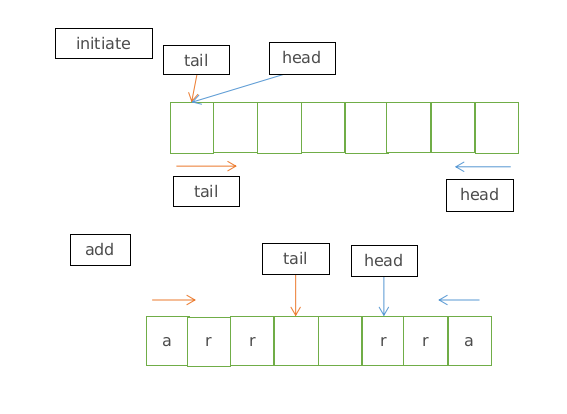
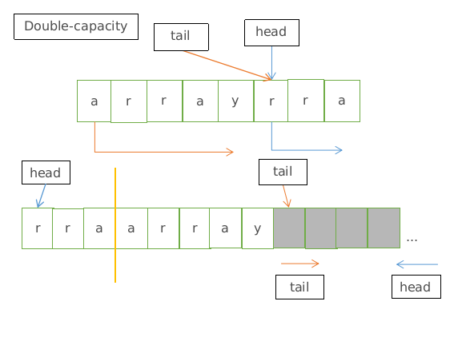
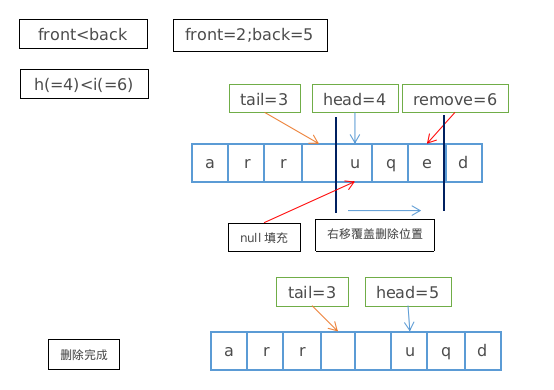
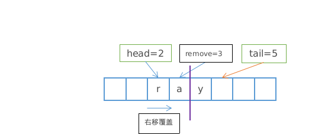
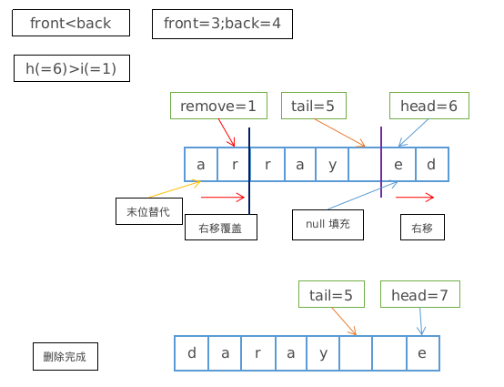

# ArrayDeque

Deque接口的大小可变数组的实现。

特性：

- 底层实现：循环数组
- 没有容量限制，在数组元素装满时自动扩容
- 禁止插入null元素
- 作为Stack和Queue时比LinkedList实现更好（前提是减少频繁的扩容和remove数组移动操作）
- 不是线程安全的

## 类结构


### 构造器

默认的ArrayDeque构造器创建的数组长度为16，而ArrayDeque能创建的最小数组长度即为16

```java
// 存储元素数组大小是2的幂  
transient Object[] elements;
/**
 * Constructs an empty array deque with an initial capacity
 * sufficient to hold 16 elements.
 */
public ArrayDeque() {
    elements = new Object[16];
}
```

## 数据结构：循环数组

循环数组通过保持数组头部head和尾部tail两个元素指针按对应的插入顺序访问元素。类似与链表的访问，java相关字段

```java
// head指针指向当前元素并插入时由后向前移动
transient int head;

// tail指针指向下个添加元素的位置。插入由前往后
transient int tail;
```

### 指针位置

#### 关系

在ArrayDeque为空时有`head == tail`：

- 初始状态：`head==tail==0`
- 删除所有元素时：`head==tail`，可能在任何位置不一定在0

当ArrayDeque一定存在元素：

- head != tail时（在add时可能有短暂的head==tail触发扩容操作）

head指针指向最近插入的head元素。tail指针指向下一个插入的tail元素位置即指向null，在addX插入扩容时短暂与head相等而不指向null。

即在 *插入时* head需要向前移动一位插入新元素并置为head-1。tail直接插入当前位置并指向下一个空位置

#### 移动

以head为例，当head在插入时向后移动，初始化时`head=0`，插入一个元素`head-1=-1`，不可为数组索引；删除时当`head=data.length-1`，删除最后元素`head+1=data.length`，不可索引。

通常的方式是对head取余如：

- `(this.head + 1) % this.data.length`插入head向前移动
- `(this.head - 1 + this.data.length) % this.data.length`删除head向后移动

但是取余%这样频繁操作可能会影响性能，ArrayDeque用分配2^n位操作[分配空间](#分配空间)的方式优化了性能

#### 插入

在插入时必定tail <= head，在扩容后`head < tail`，插入时head后移，有`tail < head`

#### 删除

删除时tail和head的位置大小无法确定，哪一种都有可能，最终都是tail左移`<--`，head右移`-->`

1. `tail < head`：指针head或tail都没有过界，head仍然在尾部，tail在头部
2. `tail > head`：指针head或tail有一个过界，head可能删除到了头部，或tail删除到了尾部。不存在同时过界
3. `tail == head`：所有元素全部删除完时tail == head，此时指针可能在数组任何位置

典型的指针位置图示：


### 插入

初始化后，tail和head指针都指向数组下标0。

addFirst将元素插入数组尾部`(head-1) & length`，插入后head指向当前最近访问元素，插入时需要将head指针向前移动一位head-1。

addLast将元素插入到数组头部`tail & length`，插入后tail指向下一个插入位置`(tail + 1) & length`，插入时直接在tail位置插入，不需要移动。

插入图示：



ArrayDeque的底层数组大小为2的次幂，这样可以使用位操作提高取余的速度

#### 取余操作

下面是使用8bit(最高位为符号位)进行addFirst的取余操作过程：

```
head = (head - 1) & (elements.length - 1)

head = 0		elements.length = 16	// 初始化时的设置
// 第一次插入
1111 1111		// (complement) head-1 =-1 
0000 1111	&	// elements.length - 1=15
0000 1111		// -1 & 15 = 15
// 第二次插入
0000 1110		// (complement) head(15)-1 = 14
0000 1111	&	// elements.length - 1 = 15
0000 1110		// 14 & 15 = 14
```

#### add源码

```java
/**
 * Inserts the specified element at the front of this deque.
 *
 * @param e the element to add
 * @throws NullPointerException if the specified element is null
 */
public void addFirst(E e) {
    if (e == null)
        throw new NullPointerException();
    // 对head指针取余，如head=0时，-1&15=15,14&15=14，将head指针从数组后面开始
    // 从head=e.length-1开始
    elements[head = (head - 1) & (elements.length - 1)] = e;
    // 扩容
    if (head == tail)
        doubleCapacity();
}

/**
 * Inserts the specified element at the end of this deque.
 *
 * <p>This method is equivalent to {@link #add}.
 *
 * @param e the element to add
 * @throws NullPointerException if the specified element is null
 */
public void addLast(E e) {
    if (e == null)
        throw new NullPointerException();
    // 直接插入tail位置
    elements[tail] = e;
    // 将tail只想后一个位置 判断tail == head就扩容
    if ( (tail = (tail + 1) & (elements.length - 1)) == head)
        doubleCapacity();
}
```

### 扩容

当`tail==head`时触发扩容操作。在插入数组最后一个空位时，相应指针会移动一位使得tail == head。

将数组容量扩大一倍，并将元素复制到新数组中。将 ***head部分移动到新数组前边*** ，***tail部分移动到head部分后面***，扩大新增的数组部分在最后面，这样保证head像新数组中由后往前`<--`移动，tail指针由前往后`-->`移动

扩容图示：



- ArrayDeque的扩容只有在`head==tail`时即插入数组最后一个空位置时执行扩容操作，使得数组扩大一倍。

- 扩容后的新数组与初始化时一样，head指针由后往前，tail指针由原length位置往后

- ArrayDeque指定容量大小为2的次幂，如果不是2的次幂，会将指定容量提高为当前最接近的2次幂
- 不应该指定容量为2的次幂，ArrayDeque仍然会扩大一次2的次幂，会增大一倍容量，如果已经考虑过最大容量，那么这样的设置将会增大一倍的空间浪费

#### 扩容源码doubleCapacity

```java
/**
 * Doubles the capacity of this deque.  Call only when full, i.e.,
 * when head and tail have wrapped around to become equal.
 */
// 仅当数组装满元素才扩大一倍
private void doubleCapacity() {
    // 检查只有head与tail相等时才允许扩容
    assert head == tail;
    int p = head;
    int n = elements.length;
    // p的右边的元素个数
    int r = n - p; // number of elements to the right of p
    // 容量扩大一倍
    int newCapacity = n << 1;
    // 2<<31溢出
    if (newCapacity < 0)
        throw new IllegalStateException("Sorry, deque too big");
    Object[] a = new Object[newCapacity];
    // 右边head开始到原数组最后r个元素复制到新数组0开始到r-1
    System.arraycopy(elements, p, a, 0, r);
    // head左边的从0开始p个元素赋值到新数组从r开始到最后
    System.arraycopy(elements, 0, a, r, p);
    elements = a;
    head = 0;
    tail = n;
}

public void addFirst(E e) {
    if (e == null)
        throw new NullPointerException();
    // 对head指针取余，如head=0时，-1&15=15,14&15=14，将head指针从数组后面开始
    // 从head=e.length-1开始
    elements[head = (head - 1) & (elements.length - 1)] = e;
    // 扩容
    if (head == tail)
        doubleCapacity();
}
```

### 分配空间

allocateElements使用位操作将指定元素数量置为刚好大于该数量的2的次幂，下面是使用8bit模拟上面的过程

```
0100 1010		// numElements=74

0100 1010 
0010 0101	|	=>	0110 1111	//	>>>1

0110 1111
0001 1011	|	=> 	0111 1111	// 	>>>2

0111 1111
0000 0111 	| 	=> 	0111 1111	//	>>>4

0111 1111	+1	=> 	1000 0000	// initialCapacity=128
```

#### `capacity=2^n`模拟分配过程

如果使用2的次幂指定ArrayDeque的大小仍然会将增大一倍。如指定为`new ArrayDeque<>(16)` ==> elements.length=32 即等价与`new ArrayDeque<>(31)`

```java
// 在源代码包中创建才能调用private elements[]
static void deleteTest() {
    ArrayDeque<String> deque = new ArrayDeque<>(8);
    deque.addFirst("d");
    deque.addFirst("e");
    
    deque.addLast("a");
    deque.addLast("r");
    deque.addLast("r");
    deque.addLast("a");
    deque.addLast("y");
    // 输出：elements.length=16
    System.out.println("elements.length=" + deque.elements.length);
    // 输出：[a, r, r, a, y, null, null, null, null, null, null, null, null, null, e, d]
    System.out.println(Arrays.toString(deque.elements));
}
```

下面以指定大小参数为8分配后容量为16的过程：

```
numElements=8		initialCapacity=8	// 

0000 1000
0000 0100	|	=>	0000 1100	// >>>1

0000 1100
0000 0011	|	=>	0000 1111	// >>>2

0000 1111
0000 0000 	|	=>	0000 1111	// >>>4

0000 1111	+1	=> 	0001 0000	// initialCapacity=16
```

#### 分配空间源码allocateElements

```java
/**
 * Allocates empty array to hold the given number of elements.
 *
 * @param numElements  the number of elements to hold
 */
// 将指定数量numElements置为接近2^n如：numElements=56 被置为64.
private void allocateElements(int numElements) {
    // 默认数组最小长度为8
    int initialCapacity = MIN_INITIAL_CAPACITY;
    // Find the best power of two to hold elements.
    // Tests "<=" because arrays aren't kept full.
    // 如果是1<<30传入进来，最后所有30位都是1，++后就为2<<31溢出，溢出就取最大值2<<30
    if (numElements >= initialCapacity) {
        initialCapacity = numElements;
        initialCapacity |= (initialCapacity >>>  1);
        initialCapacity |= (initialCapacity >>>  2);
        initialCapacity |= (initialCapacity >>>  4);
        initialCapacity |= (initialCapacity >>>  8);
        initialCapacity |= (initialCapacity >>> 16);
        initialCapacity++;
        //溢出就取最大值2<<30
        if (initialCapacity < 0)   // Too many elements, must back off
            initialCapacity >>>= 1;// Good luck allocating 2 ^ 30 elements
    }
    elements = new Object[initialCapacity];
}
```

### 删除

删除两端元素十分简单，这里解释循环数组中任意位置的删除

删除指定位置有2种情况，这里的同一端指都在循环数组的尾部或头部

- 删除位置i更靠近head位置，根据删除位置i是否与head在同一端分为head <= i（同端）和head > i（异端）
- 删除位置i更靠近tail位置，根据删除位置i是否与tail在同一端分为tail >= i（同端）和tail < i（异端）

下面以head与删除位置i的情况举例，tail的删除与head同理

注意：**front < back 表示删除位置i更接近head而不是tail**，应该结合删除的源代码理解

#### 同端（head <= i）

同端即head和删除位置i在同一部分尾部或头部，此时只需要将 ***删除位置左边的头部元素右移覆盖删除位置*** 即可



另一种形式仍然是同端的删除：



#### 异端（head > i）

异端即head与删除位置i分开在尾部和头部（顺序不定），由于head和删除位置i在数组前端和后端（顺序不定），删除该位置需要将 ***删除位置i前元素右移覆盖删除位置和将head部分右移一位*** 即可

1. 删除位置i前的所有元素右移一位覆盖删除位置i
2. 将数组位置0使用head部分数组末位元素替换
3. 移动head部分到数组末端并将head的元素置为null



#### delete源码

```java
/**
 * Removes the element at the specified position in the elements array,
 * adjusting head and tail as necessary.  This can result in motion of
 * elements backwards or forwards in the array.
 *
 * <p>This method is called delete rather than remove to emphasize
 * that its semantics differ from those of {@link List#remove(int)}.
 *
 * @return true if elements moved backwards
 */
/*
* 删除指定位置的元素。如果指定位置元素为null即删除null时无论那种情况都不会报错，而且能够正常工作
* 这个指定的null元素会被数组元素移动覆盖。
* 注意！！该方法返回值不表示删除是否失败！！返回false表示右移覆盖删除，返回true表示左移覆盖删除
*/
private boolean delete(int i) {
    // assert 检查
    checkInvariants();
    final Object[] elements = this.elements;
    final int mask = elements.length - 1;
    final int h = head;
    final int t = tail;
    // 删除元素下标i与head间隔front个，如：h=10,i=12,2&mask=2或h=8,i=2,t=3.-6&mask=10
    // 注意tail往左<--数组,head往右走-->
    final int front = (i - h) & mask;
    // 下标i与tail间隔长度back如：h=8,i=2,t=3.1&mask=1
    final int back  = (t - i) & mask;

    // Invariant: head <= i < tail mod circularity
    // t-h&mask表示数组中含有这个多元素如16中t=3,h=8,共11个元素。3-8 & 15 = 11
    if (front >= ((t - h) & mask))
        throw new ConcurrentModificationException();

    // Optimize for least element motion
    // 删除元素位置i更接近与head指针
    if (front < back) {
        // head和i在同一端  将[head...i-1]这些元素往后移动一位
        if (h <= i) {
            System.arraycopy(elements, h, elements, h + 1, front);
        } 
        // head和i不在同一端，需要移动i之前的元素后再移动head端的元素
        else { // Wrap around
            // 删除位置i前的所有元素右移一位覆盖i
            System.arraycopy(elements, 0, elements, 1, i);
            // 数组末位元素替换移动后的重复索引1位置的索引0的元素
            elements[0] = elements[mask];
            // 移动head部分即数组head到末端右移一位 
            System.arraycopy(elements, h, elements, h + 1, mask - h);
        }
        // 将移动后的head位置元素删除
        elements[h] = null;
        // 更新head位置
        head = (h + 1) & mask;
        // 注意！！！这个false不是表示删除失败，而是表示通过右移覆盖删除
        return false;
    } 
    // 删除位置更接近tail位置
    else {
        // 删除位置与tail在同一端
        if (i < t) { // Copy the null tail as well
            // 将删除位置i后面的tial部分元素左移一位覆盖删除位置
            System.arraycopy(elements, i + 1, elements, i, back);
            tail = t - 1;
        } 
        // 删除位置与tail不在同一端
        else { // Wrap around
            System.arraycopy(elements, i + 1, elements, i, mask - i);
            elements[mask] = elements[0];
            System.arraycopy(elements, 1, elements, 0, t);
            tail = (t - 1) & mask;
        }
        // 注意tail端不需要置tail位置为null，因为tail本为null,移动后用null覆盖前面的位置了
        // 注意！！！这个true不是表示删除成功，而是表示通过左移覆盖删除
        return true;
    }
}
```

#### 总结

在数组中***删除元素都是移动元素覆盖该位置***。无论时同端还是异端都是将删除位置前的元素移动一位覆盖删除位置，只不过由于异端时移动不能连续而已

指定位置靠近head时通过右移覆盖删除，指定位置靠近tail时通过左移覆盖删除

### 简单实现

[641. 设计循环双端队列](https://leetcode-cn.com/problems/design-circular-deque/)

```java
class MyCircularDeque {
    private final int[] data;
    private int head;
    private int tail;

    /** Initialize your data structure here. Set the size of the deque to be k. */
    public MyCircularDeque(int k) {
        this.data = new int[k + 1];
        this.head = 0;
        this.tail = 0;
    }

    /** Adds an item at the front of Deque. Return true if the operation is successful. */
    public boolean insertFront(int value) {
        if (this.isFull()) {
            return false;
        }

        this.head = (this.head - 1 + this.data.length) % this.data.length;
        this.data[this.head] = value;
        return true;
    }

    /** Adds an item at the rear of Deque. Return true if the operation is successful. */
    public boolean insertLast(int value) {
        if (this.isFull()) {
            return false;
        }
        this.data[this.tail] = value;
        this.tail = (this.tail + 1) % data.length;
        return true;
    }

    /** Deletes an item from the front of Deque. Return true if the operation is successful. 
    public boolean deleteFront() {
        if (this.isEmpty()) {
            return false;
        }
        this.data[this.head] = -1;
        this.head = (this.head + 1) % this.data.length;
        return true;
    }

    /** Deletes an item from the rear of Deque. Return true if the operation is successful. */
    public boolean deleteLast() {
        if (this.isEmpty()) {
            return false;
        }
        this.tail = (this.tail - 1 + this.data.length) % this.data.length;
        this.data[this.tail] = -1;
        return true;
    }

    /** Get the front item from the deque. */
    public int getFront() {
        if (this.isEmpty()) {
            return -1;
        }
        return this.data[this.head];
    }

    /** Get the last item from the deque. */
    public int getRear() {
        if (this.isEmpty()) {
            return -1;
        }
        return this.data[(this.tail - 1 + this.data.length) % this.data.length];
    }

    /** Checks whether the circular deque is empty or not. */
    public boolean isEmpty() {
        return this.head == this.tail;
    }

    /** Checks whether the circular deque is full or not. */
    public boolean isFull() {
        return this.head == (this.tail + 1) % this.data.length;
    }

}
```

## 队列Queue与堆栈Stack

### 插入

与LinkedList一样属于无界队列，不存在因为容量限制而添加失败，所以addX和offerX系列的方法本质都是一样的，但是作为queue使用时仍然应该区分这两种形式的api。

offer和add底层调用为addLast(E e)，但是在这两个方法中一个前者可以返回false(实际仍然不可offerLast)，后者返回固定值true。在需要使用true/false验证时可以使用推荐offer方法

### 删除

remove和poll方法在队列为空时前者抛出异常而后者返回null。底层实现均调用pollFirst()，区别在于前者判断为null时抛出异常而后者返回null

### 检查

element和peek方法底层实现都是返回head指针位置的数组元素，区别在于当队列为空时前者抛出异常而后者返回null

### 总结

***将ArrayDeque作为队列实现比LinkedList更好，因为其禁止插入null和有更好的性能***

链表在访问时不容易缓存命中，且需要更大的内存，作为队列唯一的好处是在迭代时更容易删除。

ArrayDeque作为队列针对与数组两端add/remove操作时要快于LinkedList，而且数组访问速度更快

但是，ArrayDeque在删除时需要移动复制数组，所以尽量避免在迭代中删除数组元素。另外需要减少在add时扩容操作，所以在创建ArrayDeque时应该指定容量

参考： [Why is ArrayDeque better than LinkedList](https://stackoverflow.com/a/6163204)

## 双端队列Deque

### 插入

- addX和offerX在存在容量限制时插入失败前者抛出异常，后者返回false。但ArrayDeque不存在容量限制因此两者并无本质区别
- addFirst与addLast在插入时使用位操作代替取余操作提高速度
- 所有的插入方法都不允许插入null元素，否则抛出异常
- head指针指向最近插入头部的元素，tail指针指向最近插入尾部元素的下一个空位置

### 删除

- removeX和pollX方法都是移除双端元素，底层方法也一致，区别在于当队列为空时前者抛出异常，后者返回null。
- 双端队列Deque是对两端元素的移除，不会对队列中的元素移除，所以不需要进行数组元素移动的操作

### 检查

- getX和peekX方法都是返回两端元素，底层均为读取数组元素，区别在于当队列为空时前者抛出异常，后者返回null
- First使用head指针，读取时head指针指向头部元素，Last使用tail指针，读取时需要往前移动到尾部元素

### 移除

- 数组的移除需要移动数组元素，代价高昂
- clear()操作仍然保留底层数组，而且只在head--tail之中移除已设置的元素为null，不用遍历完整的数组

```java
/**
 * Removes all of the elements from this deque.
 * The deque will be empty after this call returns.
 */
public void clear() {
    int h = head;
    int t = tail;
    // 验证当前ArrayDeque是否为空  
    // 注意如果arraydeque不为空则head!=tail成立(在add时可能短暂的相等)
    if (h != t) { // clear all cells
        head = tail = 0;
        int i = h;
        int mask = elements.length - 1;
        // 按照head--tail指针遍历移除元素  避免遍历整个数组
        do {
            elements[i] = null;
            i = (i + 1) & mask;
        } while (i != t);
    }
}
```

### 迭代器

- 循环数组的迭代有点类似与链表迭代，都是从head开始都tail结束，不同是循环数组的下一个元素需要用取余操作实现。
- 循环数组与链表在迭代的唯一劣势就是remove()，因为数组删除元素需要移动数组元素。在循环数组中还需要考虑左移开始右移来判断下一个位置元素是否被替换，左移被替换后需要更新当前cursor为cursor-1

```java
private class DeqIterator implements Iterator<E> {
    /**
     * Index of element to be returned by subsequent call to next.
     */
    private int cursor = head;

    /**
     * Tail recorded at construction (also in remove), to stop
     * iterator and also to check for comodification.
     */
    // 用于迭代完成检查和结构修改检查
    private int fence = tail;

    /**
     * Index of element returned by most recent call to next.
     * Reset to -1 if element is deleted by a call to remove.
     */
    private int lastRet = -1;

    public boolean hasNext() { 
        // 是否迭代到tail位置 即完成迭代
        return cursor != fence;
    }

    public E next() {
        // 迭代完成 没有元素了
        if (cursor == fence)
            throw new NoSuchElementException();
        @SuppressWarnings("unchecked")
        E result = (E) elements[cursor];
        // This check doesn't catch all possible comodifications,
        // but does catch the ones that corrupt traversal
        // 如果有其他线程修改了结构  仅能保证正确的遍历
        if (tail != fence || result == null)
            throw new ConcurrentModificationException();
        lastRet = cursor;
        // 下一个元素位置
        cursor = (cursor + 1) & (elements.length - 1);
        return result;
    }

    public void remove() {
        if (lastRet < 0) 
            throw new IllegalStateException();
        // 如果是左移 导致下一个元素移动到删除位置lastRet即cursor-1上，类似与删除数组上一个元素，需要将当前cursor-1使在next能够读取到
        if (delete(lastRet)) { // if left-shifted, undo increment in next()
            // 设置为上一个位置 原cursor表示的元素被移动到cursor-1位置了
            cursor = (cursor - 1) & (elements.length - 1);
            // tail被改变 -1
            fence = tail;
        }// 如果时右移 不会影响当前cursor位置上的元素，类似删除数组下一个元素，保持当前cursor  虽然head改变了 但是不影响cursor继续遍历
        lastRet = -1;
    }

    public void forEachRemaining(Consumer<? super E> action) {
        Objects.requireNonNull(action);
        Object[] a = elements;
        int m = a.length - 1, f = fence, i = cursor;
        // 调用foreachremaining方法后不能在调用next方法
        cursor = f;
        // 从当前位置cursor开始遍历直到fence即tail为止
        while (i != f) {
            @SuppressWarnings("unchecked") E e = (E)a[i];
            i = (i + 1) & m;
            if (e == null)
                throw new ConcurrentModificationException();
            action.accept(e);
        }
    }
}
```

#### 坑

这里要说一个坑[delete](#delete源码)，由于方法`private boolean delete(int i)`返回一个boolean值，最初没有在意，以为表示是否删除成功，当我写看到注释`This method is called delete rather than remove to emphasize that its semantics differ from those of List.remove(int)`.什么叫强调与List.remove()不同，然后就忘记了这回事，等我写完循环数组的删除时，没什么感觉，脑壳昏，没有注意到`front<back`是返回false。

然后在看迭代器时发现在remove()中`if(delete(lastRet))`，还能删除失败吗，回去看了一眼，卧槽，`front<back`居然返回false，但是不对啊，指定元素都已经被覆盖了，删除成功了啊，再回去看一下原来是表示右移，卧了个槽，还好还好，要是我当时看到返回false，我估计直接崩溃，为什么要返回false。。。

[delete](#delete源码)的注释中可能是想说，这个方法语义和remove不同，即执行delete操作而已。

### 转换数组toArray()

toArray()无参方法与其余实现一样，底层数组为`Object[]`，无法转换为原来的类型，应该尽量使用`toArray(T[])`，并且指定数组的大小推荐为deque.size()

```java
@SuppressWarnings("unchecked")
public <T> T[] toArray(T[] a) {
    int size = size();
    // 指定数组长度小于deque元素个数  创建长度为size的新数组
    if (a.length < size)
        a = (T[])java.lang.reflect.Array.newInstance(
                a.getClass().getComponentType(), size);
    copyElements(a);
    // 指定数组长度过大，将a[size]置为null 后面的位置不影响
    if (a.length > size)
        a[size] = null;
    return a;
}

/**
 * Copies the elements from our element array into the specified array,
 * in order (from first to last element in the deque).  It is assumed
 * that the array is large enough to hold all elements in the deque.
 *
 * @return its argument
 */
// 复制elements数组到指定数组。需要指定数组长度至少为deque的元素个数
private <T> T[] copyElements(T[] a) {
    // 即删除head或tail到数组另一端
    // 如果循环数组是连续的一段head在tail前:[0--head--tail--e.length-1]
    if (head < tail) {
        System.arraycopy(elements, head, a, 0, size());
    }
    // 循环数组不是连续的一段，tail在head前面:[0--tail--head--e.length-1]
    else if (head > tail) {
        // head到数组末端的长度
        int headPortionLen = elements.length - head;
        // 先复制head右边的元素head--length-1到数组a从0-headPortionLen-1
        System.arraycopy(elements, head, a, 0, headPortionLen);
        // 再复制tail左边的元素从elements的0--tail
        System.arraycopy(elements, 0, a, headPortionLen, tail);
    }
    return a;
}
```

## 参考

- [基于jdk8 ArrayDeque源码](ArrayDeque.java)
- [https://github.com/CarpenterLee/JCFInternals/blob/master/markdown/4-Stack%20and%20Queue.md](https://github.com/CarpenterLee/JCFInternals/blob/master/markdown/4-Stack%20and%20Queue.md "Stack and Queue")
